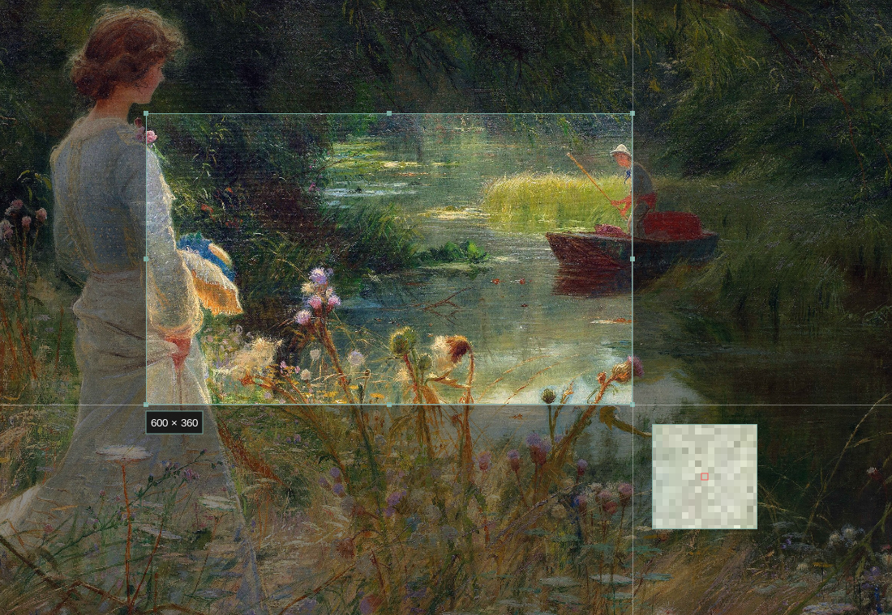
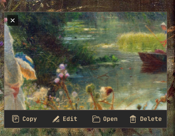
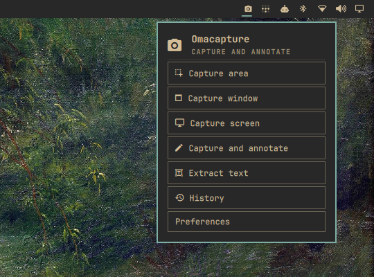
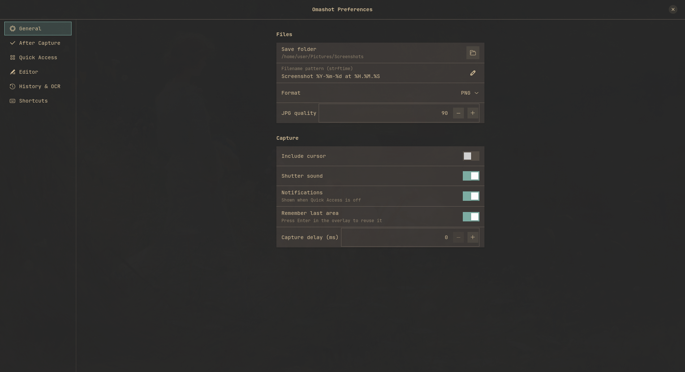
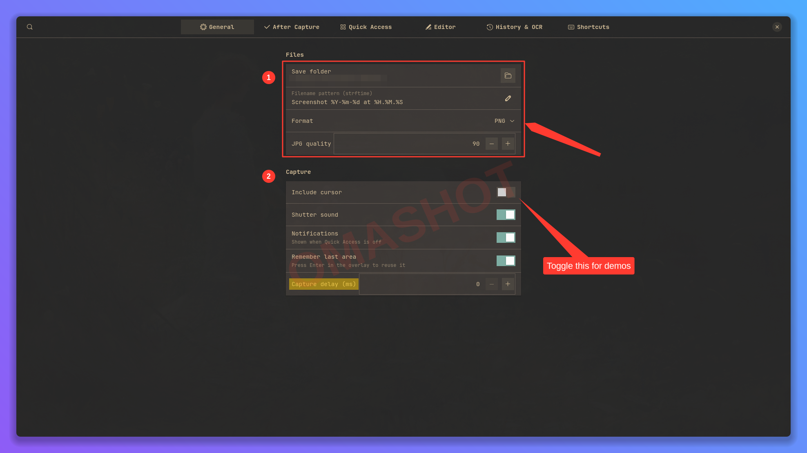

# Omacapture

Screenshot capture and annotation for [Omarchy](https://omarchy.org). A bar widget and shell service wrap a native Rust + GTK4 app: a frozen-screen region picker, a full annotation editor, Quick Access cards, capture history, OCR, and an MCP server so AI agents can take, mark up, and configure screenshots too. Everything follows your Omarchy theme.


## Highlights

<table>
<tr>
<td width="50%"></td>
<td><b>Picker.</b> The screen freezes; drag a region with a magnifier and size readout, press <code>A</code> to pick windows, Shift for a square, arrow keys to nudge, Enter to reuse the last region.</td>
</tr>
<tr>
<td></td>
<td><b>Quick Access.</b> After every capture a small card slides into the corner: copy, edit, open, delete, or drag the file straight into another app. Hover it and press <code>c</code> <code>e</code> <code>o</code> <code>Delete</code> <code>Esc</code>, or keep your hands on the keyboard: while a card is showing, <code>Super+E</code> edits, <code>Super+D</code> copies and dismisses, <code>Super+Delete</code> deletes the newest capture. Those three exist only while a card is on screen.</td>
</tr>
<tr>
<td></td>
<td><b>Bar widget.</b> Left click captures, middle click captures and annotates, right click opens this panel with every mode. Fully keyboard navigable, and reachable from scripts through <code>omarchy-shell omacapture &lt;mode&gt;</code>.</td>
</tr>
<tr>
<td></td>
<td><b>Preferences.</b> Save folder, filename pattern, formats, the after-capture matrix, Quick Access, editor defaults, history retention, OCR languages, and the Hyprland bindings to copy. Every setting is also a line in <code>config.toml</code>.</td>
</tr>
</table>

### Editor tools

Select, crop (aspect presets, edge snapping, auto-crop), rectangle, filled rectangle, oval, arrow (straight or curved; classic, tapered, or outlined; per-end heads), line, text (plain, label, callout), highlighter that snaps to OCR text lines, blur (pixelate, gaussian, hexagonal, crystallize, pointillism, halftone, tape, washi), spotlight, counters, watermark, pencil. Undo and redo, copy, paste, duplicate, zoom and pan, canvas backgrounds with padding, corner radius, and shadow.

- **Auto-redact** pixelates emails, phone numbers, URLs, card numbers, API tokens, and `key=value` credentials found by local OCR.
- **Editable sessions**: every save keeps the original pixels and annotations, so a saved screenshot reopens with everything still editable.
- **Theme aware**: colors come from the active Omarchy theme, corners are square like the shell, the font is the system monospace, and the swatch palette is built from the theme. Theme switches apply instantly.

## Install

The plugin is QML that runs inside `omarchy-shell`; the capture and editor logic is a native binary built from the same repository. Both steps are needed.

```sh
# 1. Shell plugin (bar widget + service)
omarchy plugin add https://github.com/diyahir/omacapture.git --enable

# 2. Native binary. Omarchy already ships every runtime dependency
#    (gtk4, libadwaita, gtk4-layer-shell, grim, wl-clipboard, tesseract);
#    only a Rust toolchain is needed.
omarchy install dev-env rust        # skip if you already have cargo
cargo install --path ~/.config/omarchy/plugins/io.github.diyaclanker.omacapture
omarchy-shell omacapture recheck
```

`cargo install` puts `omacapture` in `~/.cargo/bin`; the plugin looks there (and in `~/.local/bin`) itself, so it works even though the shell's own `PATH` does not include it. The widget appears in the bar's right section; move it with `omarchy bar move io.github.diyaclanker.omacapture --section center`.

## Use

| Where | What |
| --- | --- |
| Bar icon | Left click: capture (mode from the widget's `clickMode` setting). Middle click: capture and annotate. Right click: panel |
| `omarchy-shell omacapture area` | Through the shell service; also `window`, `full`, `annotate`, `ocr`, `history`, `settings`, `edit <path>`, `status` |
| `omacapture area` | The binary directly; same verbs plus `annotate FILE`, `qa copy\|edit\|open\|delete\|dismiss` for the newest card, `daemon`, `mcp`, and `--wait` for a JSON result |
| `omacapture FILE` | Opens a file in the editor, so `OMARCHY_SCREENSHOT_EDITOR=omacapture` routes Omarchy's own screenshot notification into Omacapture |

### Keybindings

Omarchy owns global shortcuts, and the plugin never edits your configuration on its own. Install bindings when you want them, from Preferences → Shortcuts or the CLI:

```sh
omacapture keybinds status            # which preset keys are free
omacapture keybinds install super-i   # Super+I area, Super+Shift+I annotate (press A in the overlay for windows)
omacapture keybinds install print     # take over Print (unbinds Omarchy's screenshot key), Shift/Ctrl/Super+Ctrl variants
omacapture keybinds remove            # take the block out again
```

This appends a clearly marked block to `~/.config/hypr/bindings.lua` (after backing it up), refuses if a key is already bound unless you pass `--force`, and reloads Hyprland. Or paste it yourself:

```lua
o.bind("SUPER + I", "Screenshot", "omarchy-shell omacapture area")
o.bind("SUPER + SHIFT + I", "Screenshot and annotate", "omarchy-shell omacapture annotate")
```

### Omarchy menu

Add to `~/.config/omarchy/extensions/omarchy-menu.jsonc` to list it under Capture:

```jsonc
"trigger.capture.omacapture": {"icon":"󰄀","label":"Omacapture","action":"omarchy-shell omacapture area"},
"trigger.capture.omacapture-annotate": {"icon":"󰏫","label":"Omacapture annotate","action":"omarchy-shell omacapture annotate"},
```

### Editor keys

| Keys | Action |
| --- | --- |
| `V C R F O A L T H B S N W P` | Select, Crop, Rectangle, Filled, Oval, Arrow, Line, Text, Highlighter, Blur, Spotlight, Counter, Watermark, Pencil |
| `Ctrl+Z` / `Ctrl+Shift+Z` | Undo / redo |
| `Ctrl+S` / `Ctrl+Shift+C` / `Ctrl+E` | Save / copy and close / export as |
| `Ctrl+C` `Ctrl+V` `Ctrl+D` `Ctrl+A` | Copy, paste, duplicate, select all (`Ctrl+C` with nothing selected copies the image) |
| `Ctrl+scroll`, `Ctrl+0`, `Ctrl+1`, Space+drag | Zoom, fit, actual size, pan |
| `Enter` / `Esc` / `A` while cropping | Apply / cancel / auto-crop to content |
| Shift while drawing | Square, circle, or 45° constraint |
| `Ctrl+B` | Toggle the canvas and background sidebar |

## Configuration

Everything lives in `~/.config/omacapture/config.toml`. Edit it by hand, through Preferences (`omacapture settings`), or with the MCP `set_config` tool; the running app picks up changes immediately. Missing keys fall back to defaults. The full file with defaults:

```toml
[general]
save_folder = "~/Pictures/Screenshots"   # or $OMARCHY_SCREENSHOT_DIR when set
filename_pattern = "Screenshot %Y-%m-%d at %H.%M.%S"
format = "png"                            # png | jpg | webp
quality = 90
include_cursor = false
sound = true
notifications = true                      # shown when Quick Access is off
remember_last_area = true
delay_ms = 0

[post_capture.fullscreen]                 # same keys for .area and .window
save = true
copy = true
quick_access = true
annotate = false

[post_capture.annotate_export]            # what a save from the editor does
save = true
copy = true
quick_access = false                      # a save refreshes an existing card; true also adds one
annotate = false

[quick_access]
enabled = true
corner = "bottom-right"                   # top-left | top-right | bottom-left | bottom-right
auto_dismiss_secs = 8                     # 0 keeps cards until dismissed
max_cards = 4
thumbnail_width = 240
keep_editing_after_drag = false
global_shortcuts = true                   # register the global chords below while a card is showing

[quick_access.shortcuts]                  # empty string disables a key
hover_copy = "c"                          # GDK key names, active while hovering a card
hover_edit = "e"
hover_open = "o"
hover_delete = "Delete"
hover_dismiss = "Escape"
global_edit = "SUPER + E"                 # Hyprland chords, alive only while a card is showing
global_copy = "SUPER + D"
global_delete = "SUPER + DELETE"
global_open = ""

[annotate]
stroke_color = "#ff3b30"                  # the theme red is used while this is the stock default
fill_color = "#ff3b3080"
text_color = "#ff3b30"
stroke_width = 4.0
font_family = "Sans"
font_size = 28.0
blur_style = "pixelate"                   # pixelate | gaussian
blur_strength = 12.0
corner_radius = 8.0
auto_crop = true
auto_redact = false
watermark_text = ""

[history]
enabled = true
retention_days = 30                       # 0 keeps forever; files on disk are never deleted
max_entries = 500

[ocr]
languages = "eng"                         # or $OMARCHY_OCR_LANGS, e.g. "eng+deu"
copy_to_clipboard = true

[mcp]
allowed_write_dirs = []                   # extra folders agents may write images into
```

The widget setting `clickMode` lives in `~/.config/omarchy/shell.json` under the bar layout entry.

## MCP server for agents

`omacapture mcp` speaks the Model Context Protocol over stdio and needs no display of its own. Nothing registers it for you; installing the plugin never touches an agent's configuration. Opt in per client, for example in Claude Code:

```sh
claude mcp add --scope user omacapture -- omacapture mcp
```

or in any MCP client's server list:

```json
{ "mcpServers": { "omacapture": { "command": "omacapture", "args": ["mcp"] } } }
```



The image above was produced entirely by an agent: one `capture_window` call, then one `annotate` call with a rectangle, counters, a blur over the folder path, a highlight, a tapered arrow, a callout, a diagonal watermark, and a gradient canvas.

| Tool | What it does |
| --- | --- |
| `list_monitors`, `list_windows` | Discover outputs and visible windows |
| `capture_screen`, `capture_area`, `capture_window` | Grab pixels headlessly; returns the saved path plus a downscaled image |
| `capture_interactive` | Ask the human to pick a region or window; blocks until they finish |
| `ocr` | Text or word boxes from a file or screen area |
| `annotate` | Every editor tool from JSON: rectangles, ovals, lines, arrows, text, labels, callouts, highlights, blur, spotlight, counters, watermark, pencil, crop, and canvas backgrounds |
| `redact` | OCR the image and pixelate emails, phones, URLs, card numbers, tokens, credentials, plus any extra regex |
| `describe_annotations` | Field reference for every annotation type |
| `get_config`, `set_config` | Read the configuration or change any setting; invalid values are rejected |
| `history_list`, `read_image`, `open_editor` | Browse recent captures, look at a file, or hand an image to the human |

`annotate` and `redact` accept `open_in_editor: true`, which saves an editable session and opens the result so the human can keep adjusting every item the agent placed.

**What an agent can and cannot do.** Tools that take an output path only write `.png`, `.jpg`, or `.webp`, only inside your save folder, the private capture cache, the source image's own folder, or directories you list under `[mcp] allowed_write_dirs`, and never replace an existing file unless `overwrite: true` is passed. `set_config` cannot change the save folder or the `[mcp]` section, so an agent cannot widen its own fence. Run `omacapture mcp --read-only` to expose only capture, OCR, read, and list tools: captures then go to the private cache and nothing user-named is ever written. Scratch captures live in `~/.local/share/omacapture/captures` with owner-only permissions and are swept with the history retention window. There is no network access anywhere.

## Update

```sh
omarchy plugin update io.github.diyaclanker.omacapture
cargo install --path ~/.config/omarchy/plugins/io.github.diyaclanker.omacapture
omarchy restart shell        # services load at shell start; bar widgets hot-reload on their own
```

## Remove

```sh
omarchy plugin remove io.github.diyaclanker.omacapture
cargo uninstall omacapture
```

Captures, history (`~/.local/share/omacapture`), and config (`~/.config/omacapture`) are left in place. An install from the earlier name, Omashot, has its config and history moved over automatically on first start.

## Dependencies and license

Runtime: `gtk4`, `libadwaita`, `gtk4-layer-shell`, `grim`, `wl-clipboard`, and `tesseract` with a language pack, all part of a stock Omarchy install; optional `canberra-gtk-play` for the shutter sound. The plugin runs unsandboxed inside `omarchy-shell` like every Omarchy plugin; it only launches the `omacapture` binary and never edits your configuration on its own.

BSD-3-Clause. See `LICENSE`.

## Development

```sh
cargo build --release && install -Dm755 target/release/omacapture ~/.local/bin/omacapture
cargo test                                    # model, redaction, and editor gesture tests
omarchy plugin validate .                     # manifest check
omarchy-shell shell rescanPlugins             # hot-reload QML after edits
cargo build --release --manifest-path tools/wlptr/Cargo.toml   # dev-only virtual pointer for live gesture tests; not part of the install
```


See `docs/SPEC.md` for the behavioral specification.
