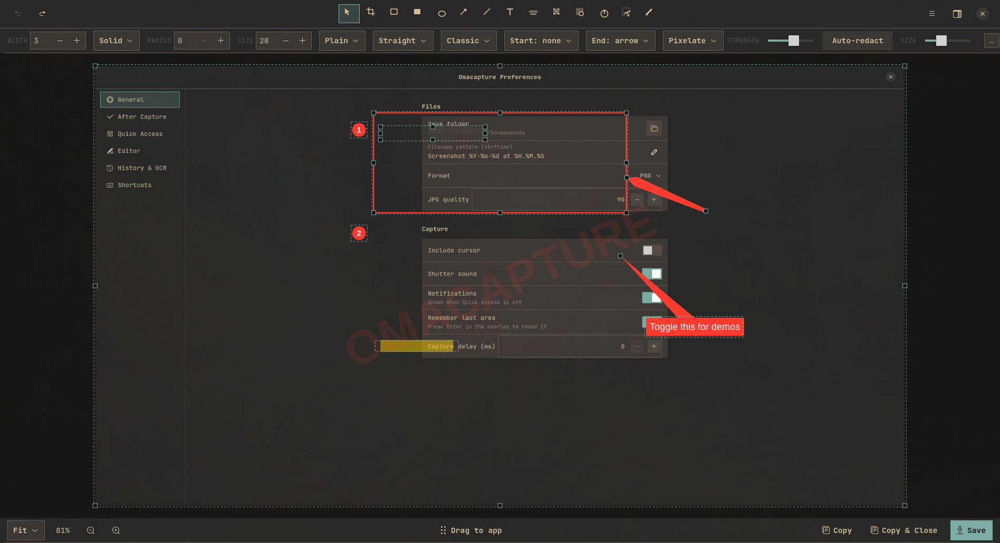

# Omashot

Screenshot capture and annotation for [Omarchy](https://omarchy.org). A bar widget and shell service wrap a native Rust + GTK4 app that does the actual work: a frozen-screen region picker, a full annotation editor, Quick Access cards, capture history, OCR, and an MCP server so AI agents can take and mark up screenshots too.



## What you get

- **Capture**: area, window, and fullscreen through `grim`. The overlay freezes the screen, shows a magnifier and size readout, highlights windows (`A` toggles window mode), constrains to squares with Shift, nudges with the arrow keys, and reuses the last region with Enter.
- **Annotate**: select, crop (aspect presets, edge snapping, auto-crop), rectangle, filled rectangle, oval, arrow (straight or curved; classic, tapered, or outlined), line, text (plain, label, callout), highlighter that snaps to OCR text lines, blur (pixelate, gaussian, hexagonal, crystallize, pointillism, halftone, tape, washi), spotlight, counters, watermark, pencil. Undo and redo, copy, paste, duplicate, zoom and pan, canvas backgrounds with padding, rounded corners, and shadow.
- **Auto-redact**: one click pixelates emails, phone numbers, URLs, card numbers, API tokens, and `key=value` credentials found by local OCR.
- **Editable sessions**: every save keeps the original pixels and annotations, so a saved screenshot reopens with everything still editable.
- **Quick Access**: a floating card after every capture with copy, edit, drag-to-app, open, and delete.
- **History** browser, **OCR** to clipboard, and a Preferences window backed by `~/.config/omashot/config.toml`.
- **MCP server** for agents: `omashot mcp`.
- **Follows your Omarchy theme**: colors from the active theme's `colors.toml`, square corners like the shell, the system monospace font, and a swatch palette built from the theme's accent colors. Theme switches apply live.

## Install

The plugin is QML that runs inside `omarchy-shell`; the capture and editor logic is a native binary built from the same repository. Both steps are needed.

```sh
# 1. Shell plugin (bar widget + service), lands disabled until you enable it
omarchy plugin add https://github.com/diyahir/omashot.git --enable

# 2. Native binary (Rust toolchain required: `sudo pacman -S rustup && rustup default stable`)
sudo pacman -S --needed gtk4 libadwaita gtk4-layer-shell grim wl-clipboard tesseract tesseract-data-eng
cargo install --path ~/.config/omarchy/plugins/io.github.diyaclanker.omashot
```

`cargo install` puts `omashot` in `~/.cargo/bin`, which Omarchy already has on `PATH`. Restart the shell or run `omarchy-shell omashot recheck` so the service notices the binary.

The bar widget appears in the right section. Move it with:

```sh
omarchy bar move io.github.diyaclanker.omashot --section center
```

## Use

| Where | What |
| --- | --- |
| Bar icon, left click | Capture an area (change with the widget's `clickMode` setting: `area`, `window`, `full`, `annotate`, `ocr`) |
| Bar icon, middle click | Capture an area and open the editor |
| Bar icon, right click | Panel with every capture action, keyboard navigable |
| `omarchy-shell omashot area` | Trigger through the shell service; also `window`, `full`, `annotate`, `ocr`, `history`, `settings`, and `edit <path>` |
| `omashot area` | Run the binary directly (same subcommands, plus `annotate FILE`, `daemon`, `mcp`) |
| `omashot FILE` | Open a file in the editor, so `OMARCHY_SCREENSHOT_EDITOR=omashot` makes Omarchy's own screenshot notification open Omashot |

### Keybindings

Omarchy owns global shortcuts. To make Print use Omashot, add to `~/.config/hypr/bindings.lua`:

```lua
hl.unbind("PRINT")
o.bind("PRINT", "Screenshot", "omarchy-shell omashot area")
o.bind("SHIFT + PRINT", "Screenshot window", "omarchy-shell omashot window")
o.bind("CTRL + PRINT", "Screenshot and annotate", "omarchy-shell omashot annotate")
hl.unbind("SUPER + CTRL + PRINT")
o.bind("SUPER + CTRL + PRINT", "Extract text (OCR)", "omarchy-shell omashot ocr")
```

### Omarchy menu

To list Omashot under Capture in the Omarchy menu, add to `~/.config/omarchy/extensions/omarchy-menu.jsonc`:

```jsonc
"trigger.capture.omashot": {"icon":"󰄀","label":"Omashot","action":"omarchy-shell omashot area"},
"trigger.capture.omashot-annotate": {"icon":"󰏫","label":"Omashot annotate","action":"omarchy-shell omashot annotate"},
```

### Editor keys

| Keys | Action |
| --- | --- |
| `V C R F O A L T H B S N W P` | Select, Crop, Rectangle, Filled, Oval, Arrow, Line, Text, Highlighter, Blur, Spotlight, Counter, Watermark, Pencil |
| `Ctrl+Z` / `Ctrl+Shift+Z` | Undo / redo |
| `Ctrl+S` / `Ctrl+Shift+C` / `Ctrl+E` | Save / copy and close / export as |
| `Ctrl+C` `Ctrl+V` `Ctrl+D` `Ctrl+A` | Copy, paste, duplicate, select all (`Ctrl+C` with nothing selected copies the image) |
| `Ctrl+scroll`, `Ctrl+0`, `Ctrl+1`, Space+drag | Zoom, fit, actual size, pan |
| `Enter` / `Esc` / `A` while cropping | Apply / cancel / auto-crop to content |
| Shift while drawing | Square, circle, or 45° constraint |
| `Ctrl+B` | Toggle the canvas and background sidebar |

### Configuration

Preferences (`omashot settings`) edit `~/.config/omashot/config.toml`: save folder (defaults to `OMARCHY_SCREENSHOT_DIR` or `~/Pictures/Screenshots`), filename pattern, format and quality, the per-mode after-capture matrix (save, copy, Quick Access, editor), Quick Access placement and timing, editor defaults, history retention, and OCR languages (defaults to `OMARCHY_OCR_LANGS`).

Widget settings live in `~/.config/omarchy/shell.json` under the bar layout entry: `clickMode` and `showDaemon`.

## MCP server for agents

`omashot mcp` speaks the Model Context Protocol over stdio and needs no display of its own. Register it in Claude Code (this repo ships a `.mcp.json`) or any MCP client:

```json
{ "mcpServers": { "omashot": { "command": "omashot", "args": ["mcp"] } } }
```

| Tool | What it does |
| --- | --- |
| `list_monitors`, `list_windows` | Discover outputs and visible windows |
| `capture_screen`, `capture_area`, `capture_window` | Grab pixels headlessly; returns the saved path plus a downscaled image |
| `capture_interactive` | Ask the human to pick a region or window; blocks until they finish |
| `ocr` | Text or word boxes from a file or screen area |
| `annotate` | Draw rectangles, arrows, labels, callouts, blur, highlights, counters, spotlight, watermark, or pencil paths onto an image, with optional crop and canvas background |
| `redact` | OCR the image and pixelate emails, phones, URLs, card numbers, tokens, and credentials, plus any extra regex you pass |
| `describe_annotations` | Field reference for every annotation type |
| `history_list`, `read_image`, `open_editor` | Browse recent captures, look at a file, or hand an image to the human in the editor |

`annotate` and `redact` accept `open_in_editor: true`, which saves an editable session and opens the result so the human can keep adjusting every item the agent placed.

## Remove

```sh
omarchy plugin remove io.github.diyaclanker.omashot
cargo uninstall omashot
```

Captures, history (`~/.local/share/omashot`), and config (`~/.config/omashot`) are left in place.

## Dependencies and license

Runtime: `gtk4`, `libadwaita`, `gtk4-layer-shell`, `grim`, `wl-clipboard`; optional `tesseract` with a language pack for OCR, highlighter snapping, and auto-redact, `canberra-gtk-play` for the shutter sound. The plugin runs unsandboxed inside `omarchy-shell` like every Omarchy plugin; it only launches the `omashot` binary and never touches your configuration without you asking.

BSD-3-Clause. See `LICENSE`. Rust crate licenses are listed by `cargo license`.

## Development

```sh
cargo build --release && install -Dm755 target/release/omashot ~/.local/bin/omashot
cargo test                                    # model, redaction, and editor gesture tests
cargo build --release --manifest-path tools/wlptr/Cargo.toml   # virtual pointer for live gesture tests (see tools/wlptr)
omarchy plugin validate .                     # manifest check
omarchy-shell shell rescanPlugins             # hot-reload QML after edits
```

See `docs/SPEC.md` for the full behavioral specification.
